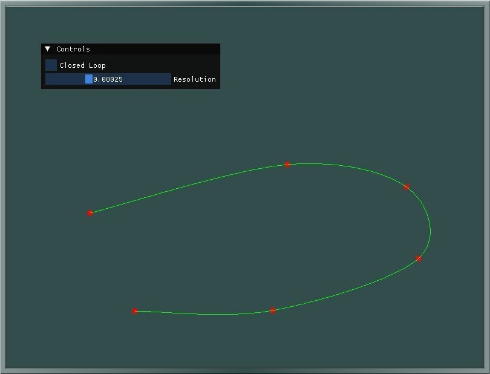
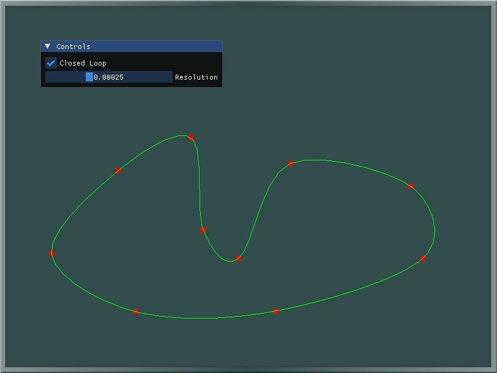

# Catmull-Rom-Spline
Spline visualizer made in OpenGL.

  

  

## Controls
- Left Click to Add Point
- Left Click On Existing Point Will Remove It
- Use GUI to Change To Closed Or Open Loop
- Use GUI to set the Resolution of Spline

## Features
- Add and Remove Spline Points
- Resolution Scale Bar
- Closed And Open Looped Spline

## Built With
- **Language**: C++ 17
- **Build System**: [CMake](https://cmake.org)
- **Third Party**: [GLFW](https://github.com/glfw/glfw), [ImGui](https://github.com/ocornut/imgui)
- **Platform**: Windows

## Getting Started
- Clone The Repository
- Run Cmake Build Command to Generate A Solution File.
- OR Open folder as Workspace using Visual Studio Code, CLion etc.
